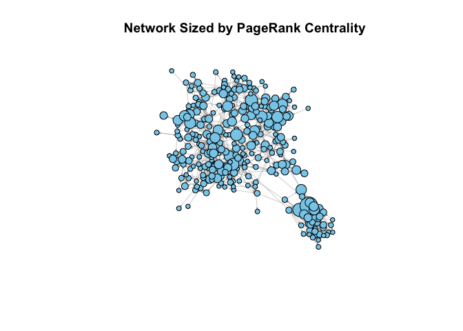
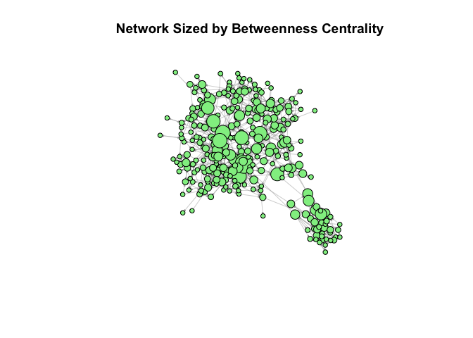

201976373_ME202_Midterm
================
2024-08-07

Constructing the Networks

    ## 
    ## Attaching package: 'igraph'

    ## The following objects are masked from 'package:stats':
    ## 
    ##     decompose, spectrum

    ## The following object is masked from 'package:base':
    ## 
    ##     union

    ## Loading required package: network

    ## 
    ## 'network' 1.18.2 (2023-12-04), part of the Statnet Project
    ## * 'news(package="network")' for changes since last version
    ## * 'citation("network")' for citation information
    ## * 'https://statnet.org' for help, support, and other information

    ## 
    ## Attaching package: 'network'

    ## The following objects are masked from 'package:igraph':
    ## 
    ##     %c%, %s%, add.edges, add.vertices, delete.edges, delete.vertices,
    ##     get.edge.attribute, get.edges, get.vertex.attribute, is.bipartite,
    ##     is.directed, list.edge.attributes, list.vertex.attributes,
    ##     set.edge.attribute, set.vertex.attribute

    ## 
    ## 'ergm' 4.6.0 (2023-12-17), part of the Statnet Project
    ## * 'news(package="ergm")' for changes since last version
    ## * 'citation("ergm")' for citation information
    ## * 'https://statnet.org' for help, support, and other information

    ## 'ergm' 4 is a major update that introduces some backwards-incompatible
    ## changes. Please type 'news(package="ergm")' for a list of major
    ## changes.

1.  Familiarise yourself with the three social support networks.

- Present in a table the number of edges, network density, and average
  (out-)degree for the three support networks (kerorice, visit,
  helpdecision).

<!-- -->

    ##         Network Num_Edges     Density Avg_Out_Degree
    ## 1      Kerorice       429 0.004847129      1.4395973
    ## 2         Visit       505 0.005705828      1.6946309
    ## 3 Help Decision       253 0.002858563      0.8489933

- Plot each network, with nodes sized by in-degree. Plot the nodes
  coloured once by caste, once by religion, and once by gender (it is
  your choice which node attribute you pair with which support network
  so you may want to try the various combinations; there is no “right”
  answer here). Make sure to include a legend with each plot to help
  interpret the node colours.

<!-- --><!-- --><!-- -->

- Describe the patterns you observe (both from the summary statistics
  and the network plots). What are the structures you observe, and how
  do the support networks differ? What might these patterns tell us
  about the nature of support relations in this village?

From the summary statistics, we can see that the number of edges in the
Visit Network has the highest number of edges (505), which shows that
within this network, there are more frequent or braoder support
connections. The Kerorice Networks comes second, with 429 edges, and the
the Help Decision Network has the fewest edges, numbering 253.

Looking to the network density, we can see that the Visit Network has
the highest density, numbering 0.0057, which indicates that it is the
most interconnected network among the three. The Help Decision Network
has the lowest density, numbering 0.0029, showing that there are sparser
connections.

For the average out-degree indicated in the summary statistics, we can
see that the Visit Network has the highest average out-degree (1.6946),
which implies that individuals tend to provide visit support to more
people in comparison to other types of support.

The Help Decision Network also has the lowest average out-degree
(0.8490), indicating more selective support relationships.

From the network plots, we can see that for the *Kerorice Network* by
Gender, the network appears to possess several clusters with a mix of
gender, and some central nodes (larger in size) indicating high
in-degree, possibly key providers of support. Males and females within
the network are relatively well distributed across the network, with no
strong gender segregation. This also suggests that gender does not
heavily influence the provision of kerorice support. The existence of
clusters shows that kerorice support may be provided within smaller,
close-knit groups, rather than across the entire network.

Looking at the *Visit Network* by Religion, we can see that there is a
dominance of Hindusim, with fewer nodes representing Islam and
Christianity. It shows a central dense cluster of Hindu individuals,
suggesting that Hindu individuals might be the primary providers and
receivers of visit support. This also shows that there is some religious
segregation present. On the other hand, the nodes representing Islam
form a distinct subcluster, showing some level of religious segregation
in visit support. The presence of subclusters also points to
intra-religious support dynamics. Furthermore, the high number of edges
and network density suggest that visit support is widely practiced and
involves frequent interactions.

The final plot, the *Help Decision Network* by caste, shows that there
is a diverse mixture of all castes. However, it is still possible to
notice the dominant presence of OBC, with green nodes dominating in
number and in size. We can also see that there are barely any Other
castes, as no orange nodes are noticeable to the eye. There are also
several small clusters, showing that help decision support is relatively
evenly distributed across different caste groups, not strongly
influenced by caste divisions, and promotes cross-caste interactions.
Furthermore, nodes of different castes are relatively well integrated,
showing that there is a more inclusive pattern of support in
decision-making contexts. The lower density and fewer edges show that
help decision support is more selective and possibly more formalised.
The lack of a clear dominant central cluster and the relatively even
distribution of different castes indicates inclusivity and
egalitarianism in decision-making support.

2.  Consider now the merged network and the position of nodes within it.

- Calculate PageRank and betweenness centrality for the merged network.
  Note that we are here using a weighted network, where the edge weights
  reflect the number of times i named j as someone they go to for
  support. For PageRank centrality, greater values are interpreted as
  greater strength. But, betweenness centrality interprets greater
  values as greater distances, so there you should specify weights = 4 -
  E(net_merged)\$weight \[this will turn an edge weight of 3 (the
  highest possible value representing the strongest relationship) into a
  1 (so, the closest) and an edge weight of 1 (the lowest possible value
  representing the weakest relationship) into a 3 (so, the furthest)\].

Nodes with higher PageRank scores are more central in the network,
indicating that they are named more frequently as sources of support.
The shape of the histogram provides insights into the overall strucuture
of the network. This right-skewed distribution could indicate that there
are a few highly central nodes (hubs), while a more uniform distribution
tells us that there is a more even spread of centrality across the
network.

    ##      Min.   1st Qu.    Median      Mean   3rd Qu.      Max. 
    ## 0.0005697 0.0011160 0.0025483 0.0033557 0.0048074 0.0200032

<!-- -->

Nodes with higher betweenness scores are more central in terms of
bridging different parts of the network. They play a critical role in
connecting disparate groups or individuals. The shape of the histogram
can tell us about the overall strucuture of the network. This
right-skewedness of the distribution shows that there are a few key
bridge nodes, while a more uniform distribtuion would show us that there
is a more even distribution of bridging nodes.

    ##     Min.  1st Qu.   Median     Mean  3rd Qu.     Max. 
    ##     0.00    91.14   701.31  1353.45  1971.36 11097.98

<!-- -->

- Plot the merged network twice, once with nodes sized by PageRank
  centrality and once with nodes sized by betweenness centrality. You
  may need to rescale the values so that differences are legible. Make
  sure that nodes are positioned in the same spot across the two plots
  by creating a static layout my_layout \<- layout_nicely(net_merged)
  and then specifying layout = my_layout when plotting. You can colour
  the nodes however you think is most informative.

The importance of nodes varies depending on the centrality measure used.
For PageRank Centrality: Nodes with high PageRank centrality are those
that are often cited by respondents as a source of support, indicating
their overall influence in the network. For Betweenness Centrality:
Nodes with high Betweenness centrality act as bridges between different
parts of the network, operating a critical position in connecting
disparate groups.

<!-- --><!-- -->

- Discuss how we might interpret these centrality measures. What might
  these structural positions reflect of the prominence, social capital,
  or influence of the residents? In your discussion, identify the
  respondents with the highest PageRank and betweenness centrality
  measures. Describe them, using what you know from the node metadata,
  and use this to help enrich your discussion.

<!-- -->

    ##   X7105601   X7105501   X7113702   X7126701   X7118801 
    ## 0.02000317 0.01331976 0.01207399 0.01165058 0.01147072

    ##  X7108501  X7123302  X7125301  X7107001  X7124701 
    ## 11097.977  8497.550  8211.217  8202.686  7818.007

To interpret these centrality measures, it is first useful to understand
that PageRank centrality measures the influence of a node based on the
number and quality of links to it. Nodes with higher PageRank are more
likely to be important or influential in the network due to the many
links they receive from other important nodes.

Betweenness Centrality measures the extent to which a node lies on the
shortest path between other nodes. Nodes with high betweenness
centrality act as bridges or brokers in the network, facilitating
communication or interaction between differing sections of the network.

We can use the structural positions discovered through the centrality
measures to see the prominence and influence of residents. For example,
respondents with high PageRank scores, ie X7105601 (who has the highest
PageRank Centrality), are considered influential within the network.
Respondent 7105601’s high PageRank centrality is reflective of his
position as a business owner and active participant in SHGs, which shows
his importance in both economic and social spheres. This influence is
not solely the result of his connections, but it is also reflective of
the quality and strategic importance of his connections, positioning him
as a key figure in the village’s social structure.

To discover brokerage and bridging roles, we can look to the respondents
with high betweenness centrality, ie X7108501 (Respondent with the
highest betweenness centrality) and X7123302 These respondents play
crucial roles in connecting different sections of the network. These
individuals broker interactions across the network as a whole, making
their key brokers. For example, 7108501 is a business owner in the lorry
driving industry and has active participation in SHGs, which enhances
his role in facilitating connections and maintaining the flow of
information and resources. Despite the fact that he is below the poverty
line, he holds significant social capital and influence due to his
proactive engagement in economic and community activities. His strategic
position as a bridge between different groups shows the importance of
diverse roles in sustaining the network’s cohesion and functionality.

We can also notice the social capital of respondents by understanding
that high centrality measures indicate individuals who possess
significant social capital, permitting them effective access to
resources and knowledge. This can be noticed through the occupations of
the individuals with high centrality scores, ie landlords, teachers and
farmers, who hold pivotal positions in the village’s socio-economic
structure.

Finally, we can also notice structural importance through these
centrality measures. The structural positions of individuals are a
reflection of their prominence and influence. High PageRank individuals
are likely central figures in their communities; while the individuals
with high betweenness centrality act as essential connectors,
facilitating flow of information and support.

3.  Return to the three social support networks and consider what helps
    us predict interpersonal relationships.

- For each network, calculate reciprocity, transitivity, and
  assortativity on the basis of caste, gender, and education. Present
  these in a table.

<!-- -->

    ##         Network Reciprocity Transitivity Assortativity_Caste
    ## 1 Help Decision   0.1660079   0.05714286           0.6897098
    ## 2         Visit   0.2217822   0.13548387           0.4366675
    ## 3      Kerorice   0.2937063   0.17430168           0.5875785
    ##   Assortativity_Gender Assortativity_Education
    ## 1            0.2173359              0.08747485
    ## 2            0.9437102              0.04084266
    ## 3            0.8776249              0.01340069

- Consider the measures across the three networks. What do these values
  tell us about the nature of sociality across the three social support
  network types?

The Kerorice network has the highest reciprocity, suggesting that
reciprocal support is most common in this network. On the other hand,
the Help Decision Network has the lowest reciprocity, showing that less
mutual support exist in decision-making contexts.

Furthermore, the Kerorice network also has the highest transitivity,
showing that individuals who support each other are also likely to
support the same people, forming tightly-knit groups. The Help Decision
Network has the lowest transitivity, indicating fewer closed triads and
possibly more dispersed support.

For assortativity by caste, the Help Decision network has the highest
assortativity by caste, indicating that support in decision-making is
highly influenced by caste. And the Visit network has the lowest
assortativity by caste, showing more cross-caste interactions in visit
support. Overall, high assortativity by caste exists across all
networks, showing strong caste-based support structures, refelcting
social divisions and preferences for intra-casete interactions.

For assortativity by gender, the Visit network has the highest
assortativity by gender, showing strong gender-based support patterns.
Kerorice network also indicates strong gender-based segregation. While
in the Help Decision network, there was the lowest assortativity by
gender, showing gender played a less significant role in decision-making
support.

For assortativity by education, the Help Decision network has the
highest assortativity by education, indicating that education plays a
more significant role in decision-making support here. The Kerorice
network has the lowest assortativity by education, showing that
education is less influential in this type of support. Overall, there is
very low assortativity by education across all networks, which suggests
that education does not play a significant role in determining support
relationships.

Overall, in the Help Decision network, there is strong caste-based
preferences and less mutual exchange, which could be showing traditional
hierarchical support systems. In the Visit Support network, it was more
interconnected and reciprocal, but highly gender-segregated, showing
social visits are more communal, but still influenced by gender norms.
And the Kerorice support network showed to be highly reciprocal and
clustered, showing collaborative decision-making within tight groups,
with significant gender and caste influences.

4.  Reflect on the researchers’ decisions regarding data collection and
    management.

The original study was aimed at studying “the impact of the choice of
injection points in the diffusion of a new product \[a microfinance
product\] in a society.” As noted at the top, they chose to survey a set
of adult residents from a sample of households in 75 villages in
Karnataka, whom they then asked a series of name generators (only some
of which we are considering here; in total, they asked 12 questions),
limiting people to naming a maximum of 4 or 5 alters for each question.
(The microfinance program was then introduced to 43 of the 75 villages,
allowing them to see who adopted it and to compare the outcomes for
residents in villages with and without the program).

- What might have been their rationale for using a socio-centric rather
  than an ego-centric approach?

The researchers likely chose a socio-centric approach because they
needed an understanding of how information and behaviours spread through
the entire community, which is better captured through a socio-centric
approach. Furthermore, the researchers may have needed socio-centric
data in order to measure network effects like social influence, peer
pressure, and community norms, these are crucial for understanding
adoption patterns. The mapping out of the entire network means that
researchers can pinpoint key individuals who are pivotal in the
diffusion process. This means that these individuals can be targeted for
interventions to maximise the spread of microfinance products. This
appraoch also allows the design of community-level interventions and
policies because of the provision of a holistic view of social structure
and dynamics. Finally, this approach also limits bias that could come
from only considering ego networks, which could miss out on important
connections and influencers outside immediate social circles of the
respondent. Overall, it is evident that a socio-centric network best
aligns with the objective of the study.

- What impact do you think their sampling decisions may have had on the
  resulting networks?

The researchers chose stratified random sampling to make sure that there
was a representative sample of the village population, which accounted
for variations in religion, geography and household composition. This
may have impacted the resulting networks by capturing diversity withijn
the village, ensuring the study results are generalisable and not biased
towards any specific subgroup.

- Why do you think they framed the name generator questions presented
  above in this way? What might some of the risks and benefits be of
  their phrasing?

They likely framed the name generator questions in this way in order to
create specificity and clarity, relevance to daily life, and elicit
varied networks, which are benefits to their framing. However, some
risks for these phrasings include recall bias, meaning that respondents
may not accurately remembers all relevant interactions, prioritising
some more recent or frequent ones. Furthermore, by restricting the
responses to 4 or 5 alters, this may cause respondents to omit less
frequent but still significant connections. Other risks include social
desirability bias, misinterpretation of questions and exclusion of
non-named alters.

- What do you see as the risks and benefits of making these data openly
  available?

The fact that the researchers made the data openly available means that
research transparency and reproducibility is improved, promoting further
research and innovation. This also creates public accountability and
trust, educational value and maximises reserach investment.

However, this decision also risks the privacy and confidentiality of the
information from respondents, who could hence be re-identified.
Furthermore, it could cause misuse and misinterpretation of the data,
harm to participants like causing stigmatisation of marginalised or
vulnerable groups. It can also means that researchers might lose control
over their intellectual property and not receive credit for their work,
and also there is a risk that open data could be used without sufficient
understanding of its limitations leading to flawed analyses.
